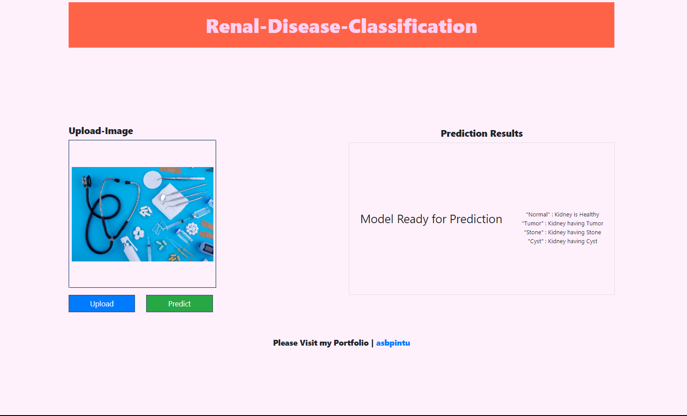
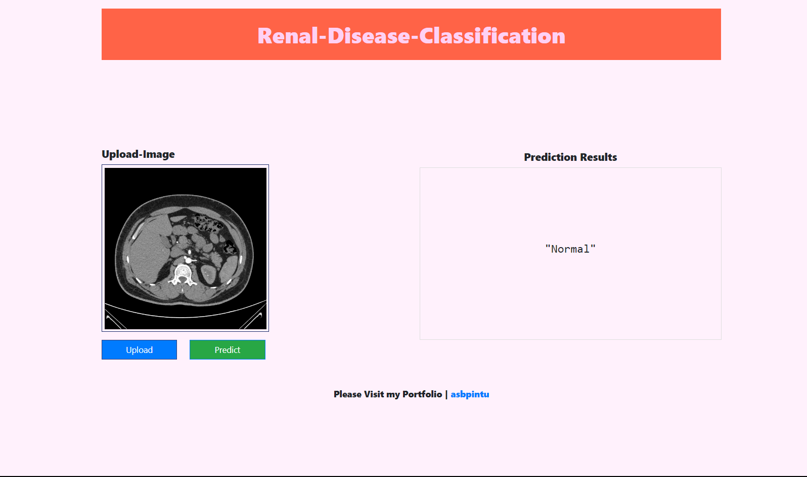
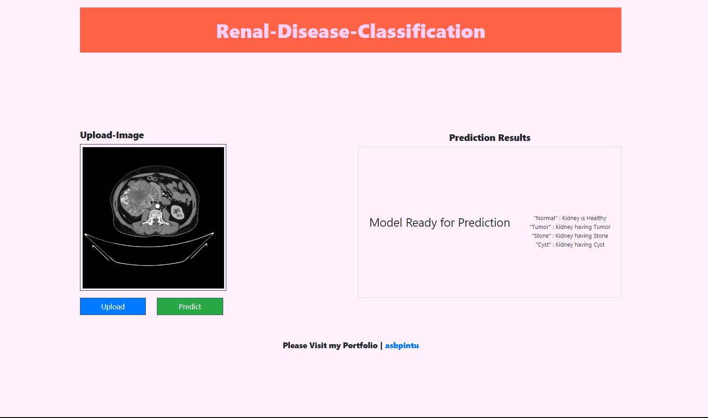
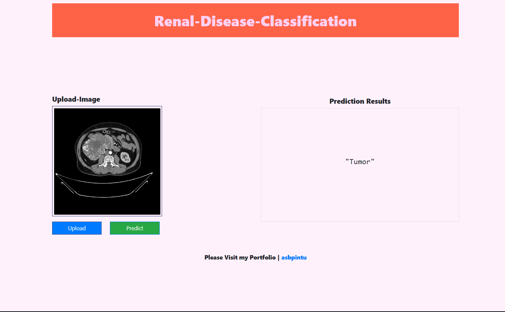
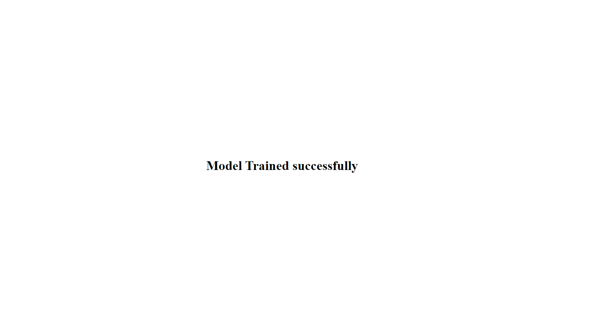

# Renal-Disease-Classification


## Introduction
In the fast-paced world of medical technology, the ability to accurately diagnose renal diseases is a game-changer. Leveraging cutting-edge artificial intelligence, a groundbreaking project has successfully classified CT scan images to identify whether kidneys are normal, harbor stones, tumors, or cysts. This transformative initiative aims to enhance the efficiency and precision of renal disease diagnosis.


 The seamless integration of data ingestion, model preparation, training, and evaluation showcased the project's robust framework. The culmination of these efforts promises to revolutionize the field, offering a reliable and efficient tool for healthcare professionals.


## Steps to Run

### 1. Clone the Repository

#### [Renal-Disease-Classification](https://github.com/asbpintu/Renal-Disease-Classification.git)

+ [https://github.com/asbpintu/Renal-Disease-Classification.git](https://github.com/asbpintu/Renal-Disease-Classification.git)

### 2. Create Environment

#### Conda Environment

```bash
conda create --name stroke python=3.9
```
#### Python Virtual Environment

```bash
python3.9 -m venv stroke

```

### 3. Activate Environment

+ *conda activate stroke* or *activate stroke* 

+ for virtual env: - *.\stroke\Scripts\activate*
 

### 4. Install the Requirements
```bash
pip install -r requirements.txt
```


### 5. Run App

```bash
python app.py
```

Now Click [CTRl + Left_Click] on the Local or Network Url to run App

or

click here [http://localhost:8080/](http://localhost:8080/)

Now Enter Details and Predict


### 6. Train Model

write /training after the url or

click here [http://localhost:8080/train](http://localhost:8080/)


# Snapshots








# ----------------------------
# ----------------
# --------

## Deployment in AWS with Github-Actions

### 1. Login to AWS console.

### 2. Create IAM user for deployment

	* Policy:

        1. AmazonEC2ContainerRegistryFullAccess

        2. AmazonEC2FullAccess
    * Save the Secret Id and Key
	
### 3. Create ECR repo to store/save docker image

        - Save the URI

### 4. Create EC2 machine

        - Ubuntu os
        - CLI

### 5. Open EC2 and Install docker in EC2 Machine:
	
        sudo apt-get update -y

        sudo apt-get upgrade
        

        * curl -fsSL https://get.docker.com -o get-docker.sh

        * sudo sh get-docker.sh

        * sudo usermod -aG docker ubuntu

        * newgrp docker
	
### 6. Configure EC2 as self-hosted runner:

        * from GITHUB
            - Setting > Actions > Runner > New self hosted runner
            - Choose os Ubuntu/Linux
        * Copy the commands one by one and run in EC2 Machine

### 7. Setup github secrets:

        * from GITHUB
            - Setings > Secret and variables > Actions > Secter - Repository secret - New repository secret
            - Add all below secret one by one

        AWS_ACCESS_KEY_ID

        AWS_SECRET_ACCESS_KEY

        AWS_REGION

        AWS_ECR_LOGIN_URI

        ECR_REPOSITORY_NAME

### 8. Now after a new commit the Deplyment process start

        - Check at GITHUB Action or
        - Click the running circle button near the new commit message


# <p style="text-align: center; color: gold">THANK YOU !!!</p>

### **BestRegards**

**Ardhendu Shekhar Behera**

email - [asbpintu@gmail.com](asbpintu@gmail.com)

linkedin - [https://www.linkedin.com/in/asbpintu/](https://www.linkedin.com/in/asbpintu/)